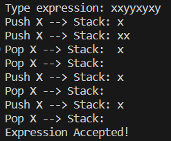
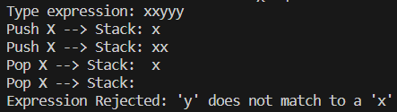

# Πανεπιστήμιο Πειραιώς

**Ημερομηνία:** 7 Ιανουαρίου 2024

**Σύνταξη από:** Αντώνιος Τσαλμπούρης, Π22272
    Δημήτριος Λαζάνας, Π22082

## Μεταγλωττιστές - Εργασία 2023-24

### Θέμα 1ο

**Ζήτημα:** Υλοποίηση ενός Ντετερμινιστικού Αυτόματου Στοίβας που αναγνωρίζει εκφράσεις υπό τους εξής όρους:

- Ίδιος αριθμός χαρακτήρων “x” και “y”.
- Κατά την ανάγνωση από αριστερά προς δεξιά, οι χαρακτήρες “y” δεν πρέπει ποτέ να υπερβαίνουν τους “x”.
- Εκτύπωση της αλληλουχίας βημάτων για αναγνώριση ή απόρριψη της έκφρασης.

**Επιλογή Γλώσσας:** C++

### Υλοποίηση

#### Class AutomatoStoivas

- **Περιγραφή:** Η κλάση AutomatoStoivas διαθέτει δομή στοίβας “char” και περιλαμβάνει μεθόδους για επεξεργασία και αναγνώριση (ή απόρριψη) των εκφράσεων, καθώς και για την εκτύπωση των ακολουθηθέντων βημάτων.
- **Συνάρτηση processExpression():** Δέχεται την έκφραση από την `main()`. Για κάθε χαρακτήρα "x" προσθέτει ένα "x" στη στοίβα, ενώ για κάθε "y" ελέγχει τη στοίβα και αφαιρεί ένα "x" εφόσον ικανοποιούνται οι όροι. Σε περίπτωση ασυμφωνίας, τυπώνεται μήνυμα απόρριψης.
- **Συνάρτηση printStack():** Εκτυπώνει τα περιεχόμενα της στοίβας, χρησιμοποιώντας βοηθητική στοίβα για την εμφάνιση των στοιχείων της.

#### main()

- **Περιγραφή:** Δημιουργεί ένα αντικείμενο της κλάσης AutomatoStoivas, ζητά την έκφραση από τον χρήστη, καλεί την `processExpression()` για τους απαραίτητους ελέγχους και τερματίζει το πρόγραμμα.

### Παραδείγματα Εκτέλεσης

#### 1. Παράδειγμα Αναγνώρισης



#### 2. Δύο Παραδείγματα Απόρριψης




---

Η δομή και η λειτουργία του προγράμματος περιγράφονται αναλυτικά, με σαφήνεια και οργάνωση, προσφέροντας μια συνοπτική και κατανοητή εικόνα του έργου και των λειτουργιών του.

### Θέμα 2ο

## Εισαγωγή Βιβλιοθηκών

```c
#include <stdio.h>
#include <stdlib.h>
#include <time.h>
```

### Ανάλυση κάθε Βιβλιοθήκης

#### 1. `<stdio.h>`
Η βιβλιοθήκη `<stdio.h>` (Standard Input/Output Header) χρησιμοποιείται για την εκτέλεση εισόδου και εξόδου στο πρόγραμμα. Συγκεκριμένα, αυτή η βιβλιοθήκη παρέχει δυνατότητες για την εκτύπωση στην οθόνη (μέσω της συνάρτησης `printf`) και για την ανάγνωση εισόδου από τον χρήστη αν χρειαστεί. Στο συγκεκριμένο πρόγραμμα, χρησιμοποιείται για την εμφάνιση μηνυμάτων και των παραγόμενων αλφαριθμητικών.

#### 2. `<stdlib.h>`
Η `<stdlib.h>` (Standard Library Header) περιέχει συναρτήσεις για διαχείριση μνήμης, αλλά και για την παραγωγή τυχαίων αριθμών, που είναι βασικό για τη λειτουργία αυτού του προγράμματος. Η συνάρτηση `rand()` χρησιμοποιείται για την παραγωγή τυχαίων αριθμών που καθορίζουν την επιλογή των ακολουθιών κατά τη δημιουργία του αλφαριθμητικού.

#### 3. `<time.h>`
Η βιβλιοθήκη `<time.h>` περιλαμβάνει συναρτήσεις για τη διαχείριση και την απόκτηση πληροφοριών για χρόνο και ημερομηνία. Σε αυτό το πρόγραμμα, χρησιμοποιείται για την αρχικοποίηση του σπόρου της τυχαίας αριθμοποίησης μέσω της συνάρτησης `srand(time(NULL))`. Αυτό εξασφαλίζει ότι οι τυχαίοι αριθμοί που παράγονται είναι διαφορετικοί κάθε φορά που εκτελείται το πρόγραμμα.


---

Κάθε βιβλιοθήκη που έχει επιλεγεί για αυτό το πρόγραμμα παίζει συγκεκριμένο ρόλο στην υλοποίηση και την αποδοτικότητα του κώδικα, συμβάλλοντας στην ολοκληρωμένη λειτουργία και την αλληλεπίδραση με τον χρήστη.

## Δήλωση Συναρτήσεων

```c
void generate_Z(char *result, int *pos, int depth);
void generate_K(char *result, int *pos, int depth);
void generate_G(char *result, int *pos, int depth);
void generate_M(char *result, int *pos, int depth);
```

Δηλώνονται οι συναρτήσεις που χρησιμοποιούνται για την παραγωγή τυχαίων αλφαριθμητικών.

## Κύρια Συνάρτηση

```c
int main()
{
    srand(time(NULL));
    char result[1000] = {0};
    int pos = 0;
    generate_Z(result, &pos, 0);
    printf("Generated string: %s\n", result);
    return 0;
}
```

Η `main()` αρχικοποιεί το περιβάλλον, τοποθετεί τον σπόρο για την τυχαία παραγωγή αριθμών και καλεί την `generate_Z()` για να ξεκινήσει τη δημιουργία του αλφαριθμητικού.

## Συνάρτηση generate_Z

```c
void generate_Z(char *result, int *pos, int depth)
{
    ...
}
```

Η `generate_Z` αρχικοποιεί το αλφαριθμητικό με έναν αριστερό παρενθετικό και καλεί την `generate_K`.

## Συνάρτηση generate_K

```c
void generate_K(char *result, int *pos, int depth)
{
    ...
}
```

Η `generate_K` καλεί τις `generate_G` και `generate_M` για να συνεχίσει τη δημιουργία του αλφαριθμητικού.

## Συνάρτηση generate_G

```c
void generate_G(char *result, int *pos, int depth)
{
    ...
}
```

Η `generate_G` προσθέτει είτε έναν χαρακτήρα 'v' εί

τε καλεί αναδρομικά την `generate_Z`.

## Συνάρτηση generate_M

```c
void generate_M(char *result, int *pos, int depth)
{
    ...
}
```

Η `generate_M` μπορεί να προσθέσει τους χαρακτήρες '-' ή '+' και να καλέσει αναδρομικά την `generate_K` ή να μην προσθέσει τίποτα (επιστρέφοντας το κενό αλφαριθμητικό).

---

Αυτή η τεκμηρίωση παρέχει μια επισκόπηση των βασικών λειτουργιών και της δομής του προγράμματος. Ο κάθε κώδικας εξηγείται με λεπτομέρεια για να κατανοήσουν οι αναγνώστες τη λογική και τη ροή του προγράμματος.

